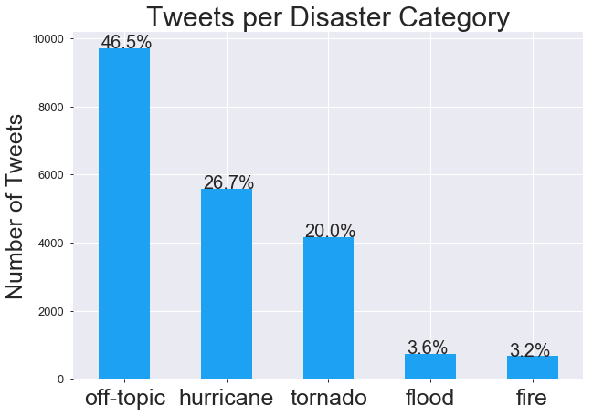
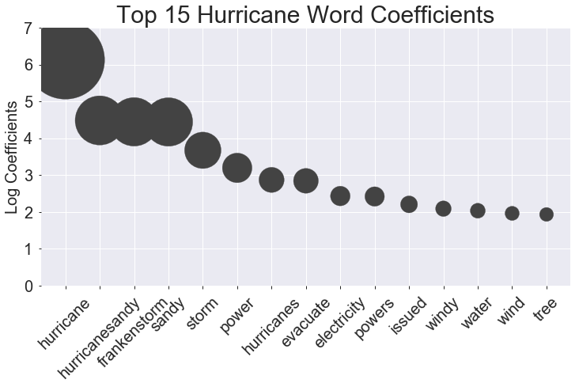
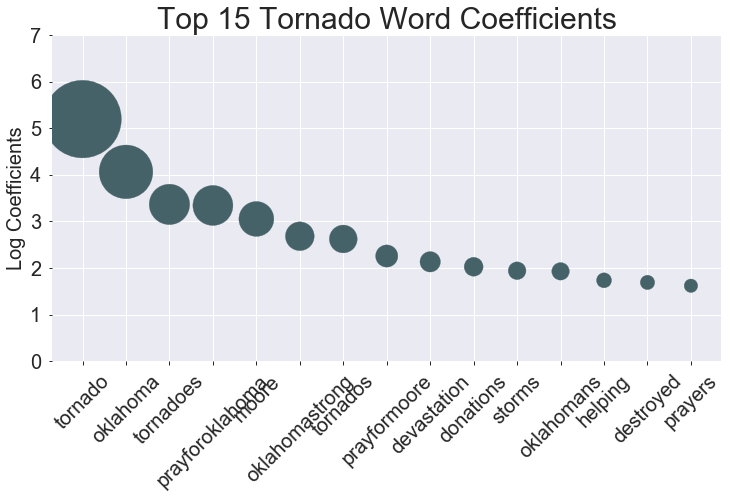

#  Project 5: Disaster Tweet Mapping
By: Femi Adenugba, Sue Moy, and Teng Mao at General Assembly in DSI-8-Boston

___

## Directory Structure

```
├── project_5_submission
    ├── code
        ├── Cape Cod Tornado Tweets EDA.ipynb
        ├── Cape Cod Tornado Tweets.ipynb
        ├── create_credentials.ipynb
        ├── eda_and_model.ipynb
        ├── pull_train_data.ipynb
        ├── tweet_mapping.ipynb
        ├── twitter_api_tweet_collection.ipynb  
    ├── datasets
        ├── cape_cod_tornado_12.csv
        ├── cape_cod_tornado_13.csv
        ├── geo_tweets.csv
        ├── map_data_DSI-LA.csv
        ├── train_co_fire.csv
        ├── train_co_flood.csv    
        ├── train_disasters.csv
        ├── train_hurricane_sandy.csv
        ├── train_ok_tornado.csv 
    ├── maps
        ├── map1.html
        ├── map2.html
        ├── map3.html    
    ├── visuals
        ├── hurricane_word_coef.png
        ├── tornado_word_coef.png
        ├── tweets_by_category.png
    ├── Mapping Disasters with Social Media Presentation.mp4
    ├── README.md
    └── disaster_tweets_location.pdf
    
```

## Executive Summary:
After a natural disaster occurs, the amount of time it takes for the disaster recovery process to begin is crucial. Lives could be in further danger, which means it's important to get emergency teams out to the affected sites as quickly as possible. 

In order to find a solution, our team decided to focus on social media. As a country that is more technologically advanced, it's very common for the public to go straight to social media to document and share their experiences. When a large event occurs in the world, news reports are unsurprisingly including firsthand footage taken by the public. As a result, why not take advantage of the real time updates that social media provides, and use it to help notify emergency responders what areas need immediate assistance?

This is where our model comes into play. The model is currently built to take tweets and classify them as being related to tornadoes, hurricanes, or neither. Should the tweets get classified as a tornado or hurricane, the location of where the tweet was posted will be marked on a map to notify the rescue and recovery teams. The current model is just the beginning and we look forward to being able to apply it to other types of natural disasters and social media applications going forward.

## Walkthrough of process:

### Problem Statement: 
Can we turn to social media to determine areas that need immediate assistance after a natural disaster?

### Plan:
We'd like to provide a model that will allow rescue teams to reference posts on social media applications for locating areas in need of assistance after a natural disaster occurs.

### Data:

We decided to focus on utilizing Twitter, as tweets are instant and it’s one of the first places people will go to for real time information. As a result, it is a great resource for getting updates regarding a natural disaster.

Using the Twitter API and the Tweepy library, we first attempted to request tweets regarding the tornadoes in Cape Cod, as it had just occurred the day before. Unfortunately, we discovered that only 5 out of the 825 tweets included geolocation. In addition, it was disovered that Twitter only allows tweets to be pulled from the last 7 days. A solution to obtaining older tweets was discovered, but due to the time constraint, we decided to utilize data from a resource referenced in past cohorts and have the Cape Code data as our final test for the model. 

 
A bar plot of the number of tweets by category was created to illustrate the training data.

From CrisisLex.org, which is a repository of disaster related tweets from all over the world, we were able to aggregate 20,873 total  tweets. There were 5,579 tweets for Hurricane Sandy in 2012, 4,168 for the Oklahoma Tornado in 2013, 743 for the Colorado Floods in 2013, 673 for the Colorado Fires in 2012, and 9,710 for off-topic tweets. Considering the class inbalance of the tweets (we had a lot more tweets for hurricanes and tornadoes than floods and fires), we decided to move forward with training the model to distinguish between hurricanes, tornadoes, and off-topic classifications as a proof-of-concept. If the future, as more tweets can be gathered for the other disasters to make up for the class inbalance, the model can be trained to classify more categories.

In addition, since so few of the tweets about the tornadoes in Cape Cod contained geolocation data, 1,000 tweets about floods in LA (700 off-topic, 300 on topic) from DSI-LA were used to properly illustrate how the mapping function of our model would generate heatmaps based on a larger number of geotagged tweets.  

#### Data Dictionary

|Feature|Type|Description|
|---|---|---|
|tweet_id|object|The unique id of the tweet| 
|tweet|object|The body text of the tweet| 
|label|object|Indicates whether the tweet is on-topic or off-topic about the disaster| 
|disaster|object|Disaster category in which the tweet belongs| 
|screen_name|object|Author of the tweet for Cape Cod tornado tweets| 
|id_str|int64|The unique id of the tweet for Cape Cod tornado tweets| 
|created_at|object|Time and date of when the tweet was created| 
|text|object|The body text of the tweet for Cape Cod tornado tweets| 
|geo_location|object|Geolocation string data for Cape Cod tornado tweets| 
|pred|object|The predicted label for Cape Cod tornado Tweets| 
|geo_location_dict|object|Geolocation dictionary data for the tweets| 
|latitude|int64|The latitude of the tweet| 
|longitude|int64|The longitude of the tweet|  

---

### Model: 

The majority of the data is for hurricanes and tornadoes, so a model was created to predict whether a tweet is related to either a tornado or hurricane ("on-topic"), or neither ("off-topic"). 

#### Pipelines

3 pipelines were created for this project:
1. CountVectorizer and Logistic Regression
2. CountVectorizer and Support Vector Machines
3. CountVectorizer and Random Forests

#### Optimal Parameters 

After putting the data through the pipelines, the GridSearchCV was utilized to generate the optimal parameters for the pipelines. The min_df was set at 2 so that rare words that occured in only one tweet would be excluded. Stop_words were excluded from the transformation to reduce noise on the data. A Lemmatizer function was used to pass through the CountVectorizer transformation to generate better results by tallying the roots of the words.

1. CountVectorizer and Logistic Regression
- max_features=3000
- min_df = 2
- ngram_range = (1,2)
- tokenizer = my_tokenizer
- stop_words = stop_words

2. CountVectorizer and Support Vector Machines
- max_features=1000
- min_df = 2
- ngram_range = (1,3)
- tokenizer = my_tokenizer
- stop_words = stop_words
    

3. CountVectorizer and Random Forests
- max_features=1000
- min_df = 2
- ngram_range = (1,3)
- tokenizer = my_tokenizer
- stop_words = stop_words
- max_depth=24
- min_samples_leaf=4
- min_samples_split=3
- n_estimators=100                    

#### Model Scores

Baseline accuracy for the dataset is 50.0%

1. CountVectorizer and Logistic Regression - accuracy score of 95.8% on the train data and 92.5% on the test data
2. CountVectorizer and Support Vector Machines - accuracy score of 89.2% on the train data and 88.6% on the test data
3. CountVectorizer and Random Forests - accuracy score of 91.9% on the train data and 91.1% on the test data

The pipeline with the highest test accuracy scores is CountVectorizer and a Logistic Regression model. However, there was a concern of overfitting with that model based on the difference in train vs. test scores. When the Cape Cod tornado final test data was processed with both the Logistic Regression and Random Forests models, the Random Forests model misclassified fewer tweets as hurricane (8) than the Logistic Regression model (30). So the final model used to classify tweets was the Random Forests model with CountVectorizer. 

---

### Word Log Coefficients:

The top 20 words with the highest log coefficients in the pipeline with a CountVectorizer and a LogisticRegression model was calculated and converted to a scatterplot.



- Hurricanesandy", "frankenstorm", "power", "evacuate", "windy", and "water" are words that jump out for Hurricane Sandy
- Based on the log coefficient of 4.45 for "frankenstorm", the appearance of that word in a tweet would indicate an 98.8% chance that the tweet is about the hurricane



- For tornado, "prayforoklahoma", "moore", "oklahomastrong", "devastation", and "donations" are all words related to the tornado that blew through Moore, Oklahoma
- Based on the log coefficient of 4.06 for "oklahoma", the appearance of that word in a post would indicate an 98.3% chance that the post is about the tornado


### Mapping: 

After a tweet is labeled "on-topic", the location of the tweet is marked on a map using the Google Maps API and the gmplot library to notify rescue teams which areas need assistance. The map feature was tested using the Cape Cod test data to confirm functionality. However, due to the lack of geolocations provided, we used a fake dataset that a previous LA cohort had created with coordinates listed. This would allow us to better showcase how the map feature would function should geolocations be more accessible with real-time tweets.


---

### Limitations:

#### 7 day restriction:
Despite getting Twitter developer accounts, we ran into the issue that we can only gather tweets as far as 7 days back from the date we requested from. This is due to the restrictions of the free Twitter developer account. Furthermore, we discovered a GetOldTweets repo by Jefferson Henrique that had an experimental Python 3 version of his scraper that can dig deep into historical tweets.

However, we eventually discovered a PyPi documentation that was an improved version of the GetOldTweets repo that functioned well with our version of Python. By that point we had already got the data we used for the models. Testing this out did deliver a multitude of tweets beyond the 7 day restriction the free API had. We were able to get tweets via queries such as time period, username, geolocation coordinates etc.

#### Lack of Geolocations:
Unfortunately, we ultimately ran into an issue of geolocations not being in the data we collected. Even if we put a search query of the longitude and latitude along with a radius, we had no luck. The other method Twitter uses to locate their users is by using their original home location as their tweet location. We believed this to be unreliable and ditched the idea of using that as geolocation data.

---

## Conclusion:

Our team discovered that using a random forest model provides more accuracy for classifying tweets that are related to a tornado or hurricane. Along with the mapping feature, this allows disasters to be recognized as they occur and will help decrease the amount of time for emergency teams to be notified of the areas that were affected. 

As our team moves forward with next steps, the mapping feature will become more optimized, and the model will be expanded to cover additional types of natural disasters.

### Next Steps:

We believe that the model has the ability to predict other natural disasters such as earthquakes and floods thus as explained previously, the model will be expanded to incorporate those. The team also would like to apply the model to other social media applications such as Facebook and Snapchat in order to ensure we capture a full range of users by age. Pew Research has broken down the age groups to display which social media apps are favoured by each age group. Twitter right now is not the most popular form of social media across age groups, that is why we chose to focus on Facebook and Snapchat in particular in the future. They capture the age groups at both ends of the spectrum well. Additionally, we ultimately feel we can create an app and a website that can go in conjunction with the major social media apps, similar to the way the Messenger app collaborates with Facebook even though it was originally part of Facebook. 

### Recommendations:

The team feels that in order to maximize the full potential of our model, a series of steps would need to be taken with the assistance of New Light Technologies. We would ask New Light Technologies to reach out to Twitter to see if Twitter would be willing to have an opt-in geo-location option for their users in situations that could be classified as a natural disaster. The way this would work is that this could be included in the user agreement if they have not signed up for Twitter, or for existing users, they can alert them to this setting the next time they log into the app. 

Building off from that, assuming the majority of users agree, we would then create an early detection warning for natural disasters if you realistically can do so. Every area would have a unique tweet threshold that would need to be hit for an early warning to be sent directly to them. This would be based on the area the user is currently in, and the population density of that area. Once that threshold is met, the model will then generate a Google map based on where the tweets are taking place along with pictures of the area describing what natural disaster is being referred. This would then be sent to everyone within the area, along being planted onto our website to help emergency services have a better idea of what exactly might be going on. 

Outside References:

- https://www.earthdatascience.org/courses/earth-analytics-python/using-apis-natural-language-processing-twitter/get-and-use-twitter-data-in-python/
- https://github.com/TungPhung/Twitter-Natural-Disaster-Mapping
- http://crisislex.org/data-collections.html#CrisisLexT6
- https://www.geeksforgeeks.org/python-plotting-google-map-using-gmplot-package/ 
- https://www.tutorialspoint.com/plotting-google-map-using-gmplot-package-in-python 
- https://github.com/Jefferson-Henrique/GetOldTweets-python
- https://pypi.org/project/GetOldTweets3/
- https://en.wikipedia.org/wiki/Hurricane_Sandy
- https://www.pewresearch.org/fact-tank/2019/04/10/share-of-u-s-adults-using-social-media-including-facebook-is-mostly-unchanged-since-2018/
___

